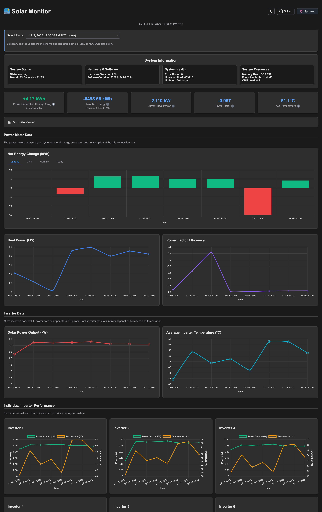

# Solarmon - Solar Monitor

Solarmon is a web application for monitoring the status of your solar panel array.
It is easily deployable for free on Cloudflare Workers and R2.



## Features

- Monitoring of historical solar panel statistics
- View collected solar panel data
- Installable on mobile (as a PWA)

## Setup

### Cloudflare R2 Bucket

1. Create an R2 bucket in your Cloudflare account.
2. Take note of the bucket name, access key ID, secret access key, and R2 endpoint. You'll need these later.

### SunPower Device Connection

1. Also connect a Wi-Fi dongle (if Wi-Fi is not built in) and connect your device to a network with internet access.
2. Connect a computer to the LAN port on the SunPower device.
3. Ensure the computer has DHCP enabled to automatically obtain an IP address.

### Collector Script Setup

1.  Copy the `collector.py` script to the collector machine using `scp`. For example:

    ```bash
    scp collector.py user@your_host:/home/user/collector.py
    ```

    This script fetches data from the SunPower's local API and uploads the results to Cloudflare R2.

2.  Edit the `collector.py` script and replace the placeholder values with your actual R2 bucket credentials and SunPower device IP address. These values are secret, so don't share them anywhere!

### Daily Execution with Crontab

1.  Open the crontab editor by running:

    ```bash
    crontab -e
    ```

2.  Add a line to schedule the `collector.py` script to run daily. Adjust the timing as needed. For example, to run it at midnight:

```bash
0 0 * * * python3 /home/user/collector.py
```

This line tells cron to execute the `collector.py` script using `python3` at 00:00 (midnight) every day. Be sure to replace `/home/user/collector.py` with the actual path to your script (it doesn't need to run as root).

Be careful with running the script too often, as it may cause excessive wear on the SunPower's internal storage.
